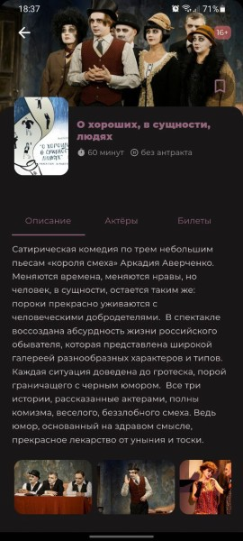

# Мобильное приложение Астраханского Театра Юного Зрителя

## Функционал
 - **Афиша предстоящих мероприятий**
 - **Архив постановок театра**
 - **Поиск по афише и архиву**
 - **Информация о постановках**
 - **Фото и видео**
 - **Актёры и роли в постановках**
 - **Список актёров театра**
 - **Покупка билетов**
 - **Штрих-код для сканирования на входе**
 - **Схема залов**

## Установка приложения
Чтобы установить приложение на устройство с **Android** - [скачайте последний файл apk](https://github.com/Bischel/astratuz_mobile_app/releases), после окончания загрузки нажмите кнопку **открыть файл** и дайте разрешение на установку приложения. После завершения установки оно появится в списке приложений и будет готово к использованию.

## Обновление приложения
При старте приложения **Астратюз** проводится проверка наличия новой версии, и если она доступна - в приложении появляется уведомление с предложением обновиться. Вы можете закрыть уведомление и вернуться к обновлению позже через боковое меню или следующем запуске приложения.

В процессе обновления приложению понадобится разрешение на доступ к медиа файлам. Это необходимо для загрузки приложения, кроме того, система может предупреждать о попытке установки приложения из неизвестного источника, в этом случае нужно согласиться. Это стандартные правила безопасности в системе Android. Приложение **Астратюз** не получает доступа к вашей приватной информации.
 
Более подробные инструкции по настройке разрешений для разных версий **Android** доступны [здесь](_guides/devices_apk_config.md).

Все версии приложения доступны для скачивания в [разделе релизов](https://github.com/Bischel/astratuz_mobile_app/releases)
